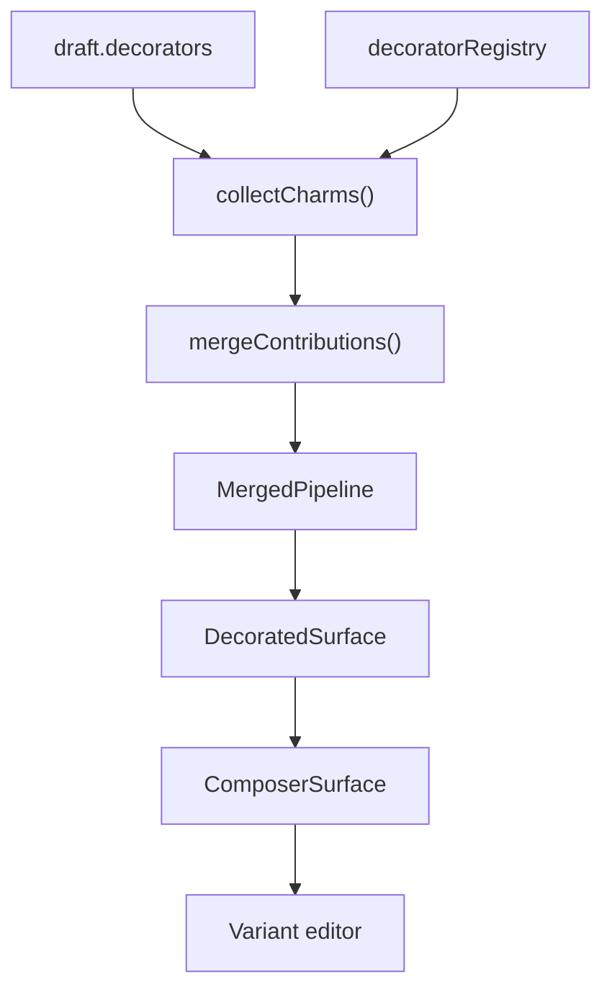

# Diary Input Decorator Architecture

The decorator system extends the diary composer (`DiaryInput`) with optional visual and behavioral layers — ticket tear stubs, timers, borders, etc. — without hard-coding those concerns into the editor shell.

Decorators are **data** on the composer draft (`draft.decorators`). At render time, each active decorator produces one or more **charms**. Charms are merged into a single **pipeline** that drives layout, styles, React elements, DOM interactions, and periodic ticks.

---

## Entry point

`DiaryInput` wraps the variant editor inside `DecoratedSurface`:

```tsx
<DecoratedSurface
  draft={draft}
  composing
  borderless
  updateDecorator={updateDecorator}
  updateDraft={updateDraft}
>
  {renderEditor()}
</DecoratedSurface>
```

Users toggle decorators from `ActionDock` via `toggleDecorator(type)`, which adds/removes entries on `draft.decorators`.

---

## Directory layout

```
decorator/
├── ARCHITECTURE.md          ← this file
├── index.ts                 # public exports
├── decoratorRegistry.ts     # type → DecoratorDefinition map + event dispatch
│
├── charms/                  # shared pipeline (types, collect, merge, hooks)
│   ├── charm.types.ts
│   ├── collectCharms.ts
│   ├── mergeContributions.ts
│   ├── useCharmPipeline.ts
│   ├── buildComposerContext.ts
│   ├── useDecoratorRuntime.ts
│   └── decoratorIndex.ts
│
├── DecoratedSurface/        # outer shell: outside-left column + input card
├── ComposerSurface/           # inner region grid around the editor
│
├── ticket/                    # ticket decorator implementation
└── timer/                     # timer decorator implementation
```

Each decorator type lives in its own folder. Convention:

| File | Role |
|------|------|
| `{name}.decorator.ts` | `DecoratorDefinition` — `createCharms` + optional `handleEvent` |
| `*Charm.ts(x)` | Factory functions returning individual `Charm` objects |
| `{Component}.tsx` | Presentational / interactive UI used by element charms |
| `{name}.utils.ts` | Pure helpers, default state factories |

---

## Core concepts

### Decorator (state)

Persisted on the draft and eventually on the sent message. Defined in `@/store/diary/type`:

- `TicketDecorator` — `state`, `ticked`, optional `placement`
- `TimerDecorator` — `mode`, `running`, `durationMs`, etc.

### Charm (render contribution)

A **charm** is not a React component. It is a declarative bundle of contributions produced by a decorator at render time. One decorator typically returns **multiple charms** (e.g. ticket returns border + shape + tear).

### Pipeline (merged output)

`useCharmPipeline(decorators, ctx)` runs:

1. `collectCharms` — walk `draft.decorators`, call each `createCharms`
2. `mergeContributions` — group styles/elements by target region and placement

The result is a `MergedPipeline` consumed by `DecoratedSurface` and `ComposerSurface`.

---

## Pipeline flow



---

## Charm contribution types

A single `Charm` can attach zero or more of **four contribution kinds** (see `charm.types.ts`):

| Kind | Field | Purpose |
|------|-------|---------|
| **Style** | `styles[]` | Inline CSS merged onto a layout target |
| **Element** | `elements[]` | React nodes rendered into a region slot |
| **Interaction** | `interactions[]` | Imperative `mount(el)` / cleanup on a DOM target |
| **Runtime** | `runtime` | Periodic tick to update decorator state |

There are no separate “style charm” / “element charm” classes — one charm object can combine both (e.g. ticket shape).

### Style contributions

```ts
{
  target: 'container' | CharmRegion,
  priority?: number,   // lower merges first; later wins on conflict
  styles: CSSProperties,
}
```

Merged by target. Higher `priority` values win; ties break on registration order.

### Element contributions

```ts
{
  region: CharmRegion,
  order: number,       // sort key within the region
  render: (ctx: ComposerContext) => ReactNode,
}
```

Elements receive `ComposerContext` (draft, decorators, `emit`, `updateDecorator`, etc.).

### Interaction contributions

```ts
{
  target: StyleTarget,
  mount: (ctx, element: HTMLElement) => void | (() => void),
}
```

Wired in `ComposerSurface` against the container ref. **Scaffolded but unused** — no current decorator registers interactions.

### Runtime contributions

```ts
{
  decoratorType: 'timer' | 'ticket',
  shouldTick: (ctx, decoration) => boolean,
  tick: (decoration, now) => MessageDecorator,
}
```

Driven by `useDecoratorRuntime` (1s interval when active). **Only timer** uses this today.

---

## Layout model

### Regions (`CharmRegion`)

| Region | Typical use |
|--------|-------------|
| `container` | Styles on the whole composer surface root |
| `header` / `footer` | Full-width bands above/below the body |
| `top` / `bottom` | Above/below the editor within the center column |
| `left` / `right` | Side columns flanking the editor |
| `overlay` | Absolute layer over the surface (pointer-events usually off) |

### Placement (`CharmPlacement`)

| Value | Behavior |
|-------|----------|
| `inside` (default) | Styles/elements route into `ComposerSurface` region wrappers |
| `outside` | Styles/elements for `left \| right \| top \| bottom` route into `DecoratedSurface` outside slots |

Outside placement lets charms render **beside** the input card instead of inside it. Ticket uses `outside` by default for the scalloped stub column.

### DOM trees

**No outside-left charms** (timer-only, or ticket with `placement: 'inside'`):

```
ComposerSurface (.root)
├── headerRegion?
├── body
│   ├── leftRegion?     ← ticket stub + tear when inside
│   ├── center
│   │   ├── topRegion?  ← timer controls
│   │   └── variantEditor (TextEditor, etc.)
│   └── rightRegion?
├── footerRegion?
└── overlayRegion?
```

**Ticket with `placement: 'outside'`** (default):

```
DecoratedSurface
└── .shell (flex row)
    ├── .outsideLeft              ← merged outsideRegionStyles.left
    │   └── TicketStub            ← SVG shape + tear button (single charm)
    └── .surfaceCard (flex: 1)
        └── ComposerSurface       ← dashed border via container styles
            └── center > variantEditor
```

**Important:** Outside elements render as **direct children** of the outside region div (wrapped in `Fragment` only). There is no per-charm wrapper. Style contributions from all outside-left charms merge onto the shared `.outsideLeft` column.

`TicketStub` layout follows full composer surface height (`[data-composer-surface]`). Compact mode uses inner body height (`[data-composer-body]`) so dashed borders do not block the `< 40px` threshold; timer top region keeps body tall enough for standard mode.

---

## ComposerContext and events

`buildComposerContext` / `useComposerContext` builds the context passed to element `render` functions and runtime ticks.

User actions use **`ctx.emit`**, which routes through `handleDecoratorEvent` in `decoratorRegistry.ts` to the matching `DecoratorDefinition.handleEvent[action]`.

Example — ticket tear button:

```ts
ctx.emit({ decorator: 'ticket', action: 'complete' });
// → ticketDecorator.handleEvent.complete(ctx, index, decoration)
```

`handleEvent` lives on the **decorator definition**, not on individual charms. Use it for discrete user actions. Use **runtime** for time-based state updates.

---

## DecoratorDefinition contract

```ts
type DecoratorDefinition = {
  createCharms: (
    decoration: MessageDecorator,
    decoratorIndex: number,
    ctx: ComposerContext,
  ) => Charm[];

  handleEvent?: Record<string, DecoratorEventHandler>;
};
```

Register new types in `decoratorRegistry.ts`:

```ts
const registry: Record<MessageDecorator['type'], DecoratorDefinition> = {
  ticket: ticketDecorator,
  timer: timerDecorator,
};
```

Also add:

- State type in `@/store/diary/type`
- Default factory in `input/composer.utils.ts` (or decorator utils)
- Toggle handling in `useComposerDraft.ts`

---

## Current implementations

### Ticket (`ticket/`)

| Charm ID | Contributions | Region | Placement | Notes |
|----------|---------------|--------|-----------|-------|
| `ticket-border` | styles | `container` | inside | Dashed border + background on composer surface root |
| `ticket-stub` | styles + element | `left` | configurable | `TicketStub`: SVG path + tear button; full-surface sizing |

Default placement: **`outside`** (`createTicketDecorator` + `getTicketPlacement`).

**Compact mode** (body height `< 40px`, excluding container border): single centered left notch with smaller radius (`compactNotchRadius: 5`), smaller corner radii (`compactBorderRadius: 6`), icon-only tear button. Timer or multi-line input grows the body past the threshold → standard mode with vertically centered multi-notch cluster, `85px` stub width, and full tear label offset 6px right of center.

### Timer (`timer/`)

| Charm ID | Contributions | Region | Notes |
|----------|---------------|--------|-------|
| `timer-display` | styles + element | `top` | Countdown display bar |
| `timer-mode` | element | `top` | Mode selector |
| `timer-controls` | element | `top` | Play / pause / reset |
| `timer-runtime` | runtime | `overlay` | Ticks while running |

All timer charms use default **`inside`** placement.

---

## Style merge rules

When multiple charms target the same region:

1. Sort by `priority` ascending (default `0`)
2. Flatten with object spread — **last writer wins** per CSS property
3. Apply result as inline `style` on the region wrapper

Element order is independent: sorted by `order` ascending within each region bucket.

---

## Adding a new decorator (checklist)

1. **State** — Add `{Name}Decorator` to `MessageDecorator` union in `store/diary/type.ts`
2. **Folder** — Create `decorator/{name}/` with `{name}.decorator.ts` and charm factories
3. **Registry** — Register in `decoratorRegistry.ts`
4. **Defaults** — Export `create{Name}Decorator()` from composer utils
5. **Toggle** — Wire `toggleDecorator` in `useComposerDraft.ts`
6. **Charms** — Split concerns into focused charms (border vs controls vs shape, etc.)
7. **Events** — Use `handleEvent` for clicks; `runtime` for intervals
8. **UI** — Keep components dumb; pass `ctx` and `decoratorIndex` where state updates are needed

Prefer **multiple small charms** over one monolithic charm — the merge step composes them cleanly.

---

## Public exports (`index.ts`)

| Export | Purpose |
|--------|---------|
| `DecoratedSurface` | Composer shell with outside placement support |
| `ComposerSurface` | Region grid (used internally; exported for reuse) |
| `getDecoratorDefinition` | Lookup decorator definition by type |
| `handleDecoratorEvent` | Dispatch `ComposerEvent` to handler |
| Timer utils | Display formatting, default factory, tick helper |

---

## Known constraints and caveats

- **Outside elements have no per-charm wrapper** — shared region styles affect all elements in that outside column.
- **`TicketStub` layout uses full composer surface height; compact uses body height** (`[data-composer-body]`) so borders do not inflate the threshold. Use `marginRight` on the outside-left column for gap to the input card.
- **Outside top/right/bottom slots** exist in types and merge logic but are not yet rendered in `DecoratedSurface` (only `outsideLeft` is implemented).
- **Interaction contributions** are wired in `ComposerSurface` but unused by any decorator.
